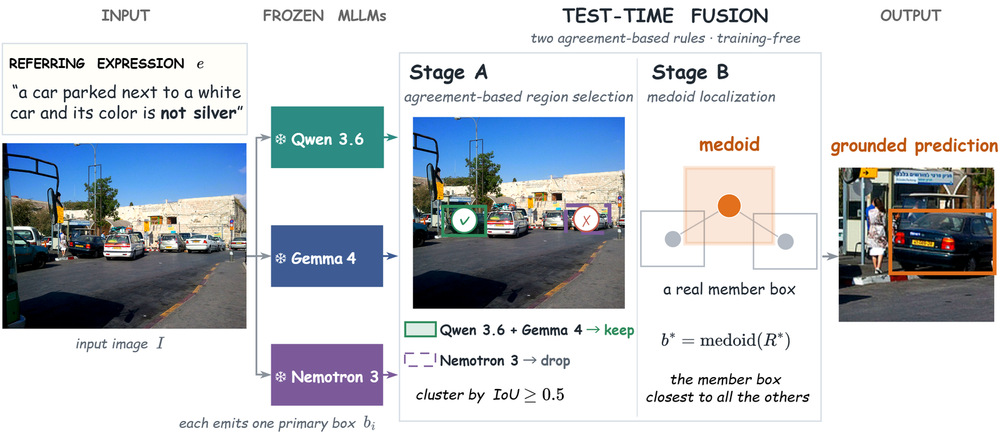

# FORUM

### Frozen Outputs Reconciled Using Model Agreement for Visual Grounding

[](https://accv2026.org/)
[](https://www.python.org/)
[](https://docs.astral.sh/uv/)
[](https://github.com/Neurogica/FORUM/actions/workflows/ci.yml)
[](LICENSE)

**Fuse a few frozen multimodal LLMs at test time with two fixed geometric rules.** FORUM keeps the region that the most distinct models agree on and returns the medoid member box, with no fine-tuning, no learned selection parameters, and no change to the standard prompted-MLLM interface.

<p align="center">
  
</p>

<p align="center">
  <a href="#results">Results</a> ·
  <a href="#getting-started">Getting started</a> ·
  <a href="#regenerating-member-predictions">Regenerate predictions</a> ·
  <a href="#citation">Citation</a>
</p>

<details>
<summary><strong>Abstract — click to expand</strong></summary>

Frozen multimodal large language models (MLLMs) now solve standard referring expression comprehension with a single prompted call, yet on adversarial benchmarks with same-category distractors and negation, even the largest models are confidently wrong, and resampling repeats the error. Models built from different data and architectures rarely fall for the same confounder, so their agreement is a strong label-free signal of the correct target. We present FORUM, a training-free test-time fusion of frozen MLLMs guided by two fixed geometric rules: agreement-based selection keeps the region supported by the most distinct models, and medoid localization returns an actual member box instead of a coordinate average, so one loose prediction cannot shift the answer. Fusing three open MLLMs, FORUM surpasses the 397B-parameter published reference by a relative 5% in mean accuracy on the adversarial Ref-Adv-s benchmark, and a plain averaging ensemble by 15%. The gains transfer to standard RefCOCO+, and a balanced lineup with no dominant member still surpasses the 397B model by 5%.

</details>

## How it works

1. **Prompt.** Each frozen member is prompted once for a bounding box (greedy decoding). Nothing is fine-tuned and no logits are needed.
2. **Stage A: agreement-based selection.** Pool the candidate boxes, cluster them by single-link IoU (τ = 0.5), and keep the cluster supported by the most distinct models. Models from different families rarely fall for the same distractor, so cross-model agreement is a label-free confidence signal.
3. **Stage B: medoid localization.** Return the member box in the selected cluster that agrees most with the others. It is an actual prediction, never a coordinate average, so one loose member cannot drag the answer off-target.

The fusion is a few dozen lines of NumPy in [`src/forum/fusion.py`](src/forum/fusion.py). Running the member models is a separate GPU inference step; their predictions used in the paper are bundled, so every table reproduces offline.

## Results

Mean of Acc@{0.5, 0.75, 0.9} on the adversarial **Ref-Adv-s** benchmark (n = 1,142). The dominant lineup fuses Qwen3.6-35B-A3B, Gemma-4-31B and Nemotron-3-Nano-Omni-30B-A3B; the balanced lineup fuses Qwen3.5-27B, Gemma-4-31B and GLM-4.6V-Flash. Bold marks the best entry per column.

| System | Mean ↑ | @0.5 ↑ | @0.75 ↑ | @0.9 ↑ |
| :-- | --: | --: | --: | --: |
| *Specialist* | | | | |
| Grounding DINO | 15.9 | 19.7 | 17.2 | 10.7 |
| DeRIS-B | 21.1 | 28.3 | 22.2 | 12.8 |
| *Single MLLM* | | | | |
| Nemotron-Omni-30B | 21.5 | 51.5 | 9.5 | 3.6 |
| GLM-4.6V | 48.3 | 60.0 | 51.4 | 33.5 |
| Gemma-4-31B | 49.4 | 64.7 | 53.5 | 30.0 |
| Qwen3.5-27B | 49.9 | 64.3 | 52.4 | 32.9 |
| Qwen3.6-35B-A3B | 52.2 | 65.1 | 55.3 | 36.3 |
| Qwen3.5-397B-A17B-FP8 (published) | 52.6 | 68.0 | 55.6 | 34.2 |
| *Test-time fusion, dominant lineup* | | | | |
| Plain ensemble (coordinate average) | 48.2 | **70.2** | 57.7 | 16.7 |
| **FORUM** | **55.4** | 69.8 | **59.2** | **37.2** |
| *Test-time fusion, balanced lineup* | | | | |
| Plain ensemble (coordinate average) | 54.5 | 69.4 | 59.5 | 34.5 |
| **FORUM** | **55.3** | 69.1 | 59.5 | **37.2** |

<details>
<summary><strong>Transfer to standard RefCOCO+ (dominant lineup)</strong></summary>

Mean of Acc@{0.5, 0.75, 0.9}; RefCOCO+ splits use a deterministic 600-expression subset (seed 7).

| System | Ref-Adv-s ↑ | RefCOCO+ val ↑ | RefCOCO+ testA ↑ | RefCOCO+ testB ↑ |
| :-- | --: | --: | --: | --: |
| Nemotron (single) | 21.5 | 31.9 | 34.0 | 27.2 |
| Plain ensemble | 48.2 | 60.8 | 64.3 | 55.7 |
| Gemma-4 (single) | 49.4 | 61.8 | 59.2 | 58.8 |
| Qwen3.6 (single) | 52.2 | 75.5 | **80.4** | 67.5 |
| **FORUM** | **55.4** | **76.4** | 80.3 | **69.2** |

</details>

The single-MLLM and fusion rows reproduce offline from the bundled predictions (see below). The specialist rows and the 397B entry are transcribed from the paper; the 397B number is the published leaderboard value, not a rerun under our pipeline. Paired bootstrap tests, the leave-one-member-out study, the clustering-threshold sweep and the agreement-versus-confidence analysis are all reproducible with the scripts in `scripts/`.

## Getting started

Requires Python 3.10 or newer and [uv](https://docs.astral.sh/uv/getting-started/installation/). From the repository root:

```bash
uv sync --locked
uv run --locked python scripts/evaluate.py --benchmark refadv --lineup dominant
uv run --locked python scripts/evaluate.py --benchmark refadv --lineup balanced
```

Each call prints the singles, the plain ensemble and FORUM in seconds, with no GPU and no download. Further options:

```bash
# Leave-one-member-out, localization-rule ablation, tau sweep, per-facet breakdown
uv run --locked python scripts/evaluate.py --benchmark refadv --lineup dominant --loo --ablation --tau-sweep --facets

# Transfer splits
uv run --locked python scripts/evaluate.py --benchmark refcocoplus_testB --lineup dominant

# Paired bootstrap significance (FORUM vs. best single, FORUM vs. plain ensemble)
uv run --locked python scripts/significance.py --benchmark refadv --lineup dominant

# Agreement versus confidence (2x2 table, agreement calibration, error correlation)
uv run --locked python scripts/agreement_analysis.py --lineup balanced
```

Benchmarks: `refadv` and `refcocoplus_{val,testA,testB}`. Lineups: `dominant` and `balanced`.

## Regenerating member predictions

Each runner queries one frozen model and writes `predictions/<benchmark>/<member>.jsonl`. `--zoom` adds the zoomed re-ask candidate and `--k` adds stochastic samples for the self-consistency analysis. Models and benchmarks (`dddraxxx/ref-adv-s`, `lmms-lab/RefCOCOplus`) are pulled from the Hugging Face Hub; a GPU is required.

```bash
uv sync --locked --extra inference

uv run python -m forum.runners.qwen --model Qwen/Qwen3.5-27B --k 8 \
    --benchmark refadv --output predictions/refadv/qwen35_27b.jsonl
uv run python -m forum.runners.gemma --zoom \
    --benchmark refadv --output predictions/refadv/gemma4_31b.jsonl
uv run python -m forum.runners.glm --zoom \
    --benchmark refadv --output predictions/refadv/glm46v.jsonl

# Nemotron is served with vLLM first (see the module docstring), then:
uv run python -m forum.runners.nemotron \
    --benchmark refadv --output predictions/refadv/nemotron_30b.jsonl

# RefCOCO+ splits use greedy decoding on the deterministic 600-row subset:
uv run python -m forum.runners.qwen --model Qwen/Qwen3.5-27B --sample 600 \
    --benchmark refcocoplus:testB --output predictions/refcocoplus_testB/qwen35_27b.jsonl
```

The fusion has no learned parameters, so any prompted MLLM can be added as a member: write a runner that emits the same JSONL schema and register it in `scripts/evaluate.py`.

## Development

```bash
uv sync --locked
uv run --locked ruff check .
uv run --locked python scripts/evaluate.py --benchmark refadv --lineup dominant
```

CI runs the lint and the offline evaluation of both lineups on Python 3.10, 3.11 and 3.12.

## Repository contents

```text
src/forum/
  fusion.py       FORUM: agreement-based selection (Stage A) and medoid localization (Stage B)
  boxes.py        box validation, IoU, coordinate conversion, output parsing
  data.py         benchmark loading (Ref-Adv-s, RefCOCO family)
  runners/        per-model prediction runners (Qwen, Gemma, GLM, Nemotron)
scripts/
  evaluate.py           result tables, leave-one-out, ablations, facets
  significance.py       paired bootstrap tests
  agreement_analysis.py agreement versus confidence, error correlation
predictions/      member predictions used in the paper (both lineups, all splits)
assets/           method figure and teaser
uv.lock           resolved dependencies
```

## Citation

```bibtex
@inproceedings{sato2026forum,
  title     = {{FORUM}: Frozen Outputs Reconciled Using Model Agreement for Visual Grounding},
  author    = {Taiyo Sato and Takamasa Sanda and Keisuke Maeda and Takahiro Ogawa and Miki Haseyama and Shunya Nagashima},
  booktitle = {Proceedings of the Asian Conference on Computer Vision (ACCV)},
  year      = {2026}
}
```

[CITATION.cff](CITATION.cff) separately describes the software.

## License

[BSD-3-Clause](LICENSE). The benchmarks (Ref-Adv-s, RefCOCO+ and their COCO images), the member models and dependencies remain subject to their respective licenses and terms.
